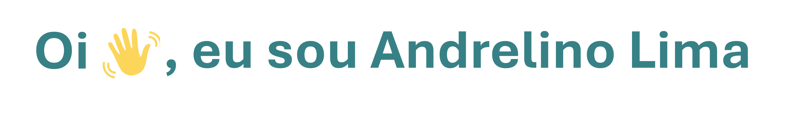

<h3 align="center">Analista de Tecnologia da Informação</h3>
<h3 align="center">Criador do projeto <a href="https://openkit.com.br">OpenKit</a></h3>
  

 

- 🌐 Analista de TI em: [Regsa Metalúrgica](https://www.regsa.com.br)

- 🌐 Projeto pessoal: [openkit.com.br](https://openkit.com.br)

- 🌐 Treinamentos / Consultoria - Saiba Mais em: [andreinformatica.com](https://#)

- ▶️ Youtube: [@andre.informatica](https://www.youtube.com/@andre.informatica)

- ▶️ Website / Portfólio: [andreinformatica.com](https://www.andreinformatica.com)

  
- 🙇🏽‍♂️ Estudando atualmente:
<ul>
           <ol></ol>
            <ol>DevOps & Agile Culture - FIAP</ol>
            <ol>FullStack Developer - CodeStart</ol>
            <ol>Proxmox VE - Projeto Empresa Livre  </ol>
</ul>

  

- ✉️ Você me encontra no e-mail: *contato@andreinformatica.com*

  
<h3 align="left">Habilidades:</h3>

<h4 align="left">Rede de Computadores:</h4>

- Unifi Controler - Redes sem fio;
- VLAN;
- Cabeamento UTP / Crimpagem RJ45;
- Configurações de Switchs e Roteadores;
- TCP / IPV4;

<h4 align="left">Infraestrutura</h4>

- Administração de Servidores Windows;
- Administração de Servidores Linux (Debian / Rock Linux);
- DNS;
- DHCP;
- HTTP;
- Active Directory;
- Web Server - PHP / Apache / Nginx Reverse Proxy;
- Virtualização de Servidores;
- NAS Soluções de Backups;
- Implantação de banco de Dados SQL / Mysql / Supabase;
- Domínio e Hospedagem;
- Microsoft 365;
- Hardware Desktop / Servidores (Manutenção Preventiva e Corretiva);

<h4 align="left">Desenvolvimento:</h4>

- Wordpress;
- Noções de soluções Nocode (Bubble);
- Git & GitHub;
- HTML;
- CSS;
- Javascript;
- Bootstrap;
- React;
- NodeJS;
