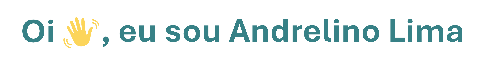

<h3 align="center">
Analista de TI - Empreendedor
</h3>  

Profissional de TI com mais de 10 anos de experiência em infraestrutura, cloud computing, redes e desenvolvimento de aplicações.

Desenvolvedor de soluções SaaS voltadas à automação de processos empresariais com uso de tecnologias modernas e Inteligência Artificial.

Fundador da NODIGITAL, iniciativa focada em inovação e desenvolvimento de soluções tecnológicas.  

🔗 https://nodigital.com.br  

---

## 🚀 Projetos em Destaque

### 🚗 AppDrive — SaaS Gestão de Locações
Sistema completo para **gestão de locação de automóveis**.

🔗 https://appdrive.com.br  

**Principais recursos:**
- Gestão de contratos de locação
- Cadastro de veículos e clientes
- IPVA
- Multas
- Relatórios
- Controle financeiro
- Dashboard administrativo
- Integração API de pagamentos Pix
- Inteligência Artificial embarcada - Groq / GPT OpenIA
- Plataforma SaaS Multi-Empresa

**Principais tecnologias:**
- HTML, CSS, JS, TYPESCRIPT
- POSTGRESQL / Supabase Auth - Storage
- Cloudflare / Vercel / Supabase
---

### 💬 CorpChat — Chat Corporativo
Aplicação de **comunicação interna para empresas**, distribuída em container Docker.

📦 Docker Hub: https://hub.docker.com  
🐳 Deploy simplificado via Docker  

**Principais recursos:**

- Chat interno corporativo - Estilo Whatsapp Web
- Comunicação em tempo real com possibilidade de envio de anexos
- Deploy rápido em containers
- Ideal para ambientes empresariais Simples
- 
---

## 💼 Experiências Anteriores

- 🌐 Suporte de TI — Hospital Geral de Itapevi
Realizei tarefas de suporte a usuários em ambiente de rede Microsoft

- 🌐 Assistente de TI — Hospital Infantil Sabará
Realizei tarefas de Gestão de TI - Apoio em análise de contrartos, custos de Infraestrutura de TI, Gestão de Equipe.

- 🌐 Analista de TI — Regsa Metalúrgica  
Realizei tarefas de pesquisas e implementação de novas tecnologias em ambiente Híbrido, segurança da informação, sempre com foco em melhoria contínua e redução de custos de infraestrutura

---

## 📚 Atualmente Estudando

- DevOps & Agile Culture — FIAP
- FullStack Developer — CodeStart
- Proxmox VE — Projeto Empresa Livre

---

## 🛠️ Tecnologias & Ferramentas

### Infraestrutura
- Linux (Debian / Rocky Linux)
- Windows Server
- DNS / DHCP
- Active Directory
- Virtualização
- NAS / Backup
- Microsoft 365

### Redes
- VLAN
- TCP/IP
- Unifi Controller
- Configuração de Switches e Roteadores
- Cabeamento estruturado

### Monitoramento & Segurança
- Zabbix
- Grafana
- BitDefender GravityZone
- Políticas de segurança
- Firewall

### Desenvolvimento
- HTML
- CSS
- Javascript
- React
- Node.js
- Bootstrap
- Wordpress
- Git / GitHub

---

## 📊 Estatísticas GitHub

---

## 📫 Contato

📧andre@nodigital.com.br 

📱 WhatsApp  
(11) 98364-1085
